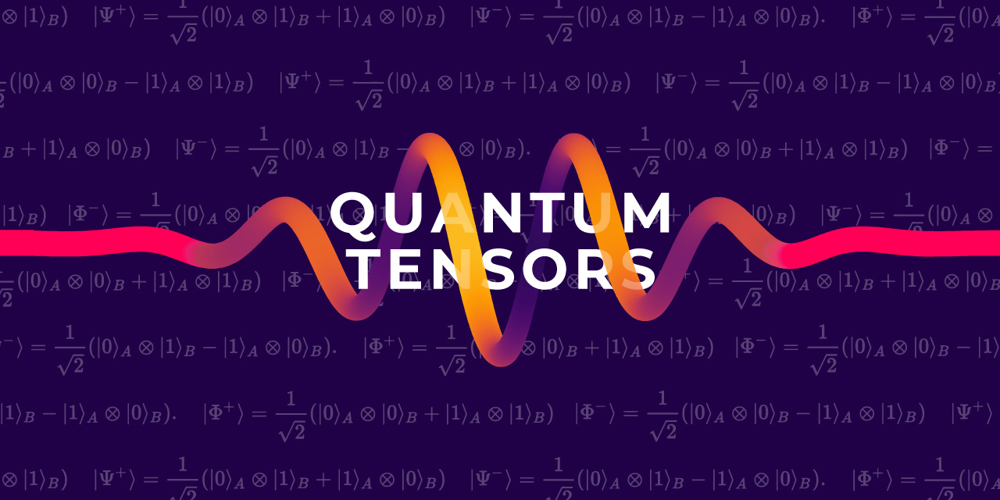

# Quantum Tensors

It is a JavaScript / TypeScript package for sparse tensor operations on complex numbers.
For example for quantum computing, quantum information, and well - the Quantum Game.

`(1.00 +0.00i) |1,2,>,V⟩` -> `(-0.71 +0.00i) |1,2,>,H⟩ + (0.71 +0.00i) |1,2,>,V⟩`

Developed at the [Centre of Quantum Technologies](https://www.quantumlah.org/), National Univeristy of Singapore, by [Piotr Migdał](https://p.migdal.pl/), [Philippe Cochin](https://github.com/sneakyweasel) et al.
It is a part of the [Quantum Game 2](https://github.com/stared/quantum-game-2) project.

We base the philosophy of this package on:

* Sparse operations (both for vectors and matrices)
* Complex numbers
* Tensor structure 
* Named tensor dimensions (vide [Tensors considered harmful](http://nlp.seas.harvard.edu/NamedTensor)): there is a difference between a 2x2 operator on spin and on polarization. It helps with catching errors.

Documentation: [p.migdal.pl/quantum-tensors](https://p.migdal.pl/quantum-tensors) (generated by [TypeDoc](https://typedoc.org/)).



## Usage

Right now, you can install this package from this GitHub repository.
If you use NPM:

```
npm install stared/quantum-tensors#master
```

And if you use yarn:

```
yarn add stared/quantum-tensors#master
```

It will download it and run scripts to process TypeScript files, so it generates JavaScript.
Right now, we intend to use it with TypeScript only - if you tried to use it with JavaScript, let us know!

And then in your project write:

```{ts}
import * as qt from 'quantum-tensors'
```

Once it gets more mature, I will push it to the NPM repository.


## Why

For "Quantum Game 2" we needed a fast and precise way to simulate quantum stuff, so after tinkering with [mathjs](https://mathjs.org/) and [TensorFlow.js](https://www.tensorflow.org/js) we decided to code what we need from scratch.
At some point, we may want to use one of these libraries for backend, if we discover that it helps.

Also, [https://github.com/stared/thinking-in-tensors-writing-in-pytorch](https://github.com/stared/thinking-in-tensors-writing-in-pytorch) by Piotr Migdał.

## Contributing

* Create [TSDoc](https://www.npmjs.com/package/@microsoft/tsdoc) for each new function, class, and method
* Setup [ESLint](https://eslint.org/) configured as in this `.eslintrc.js` 
* Try to adhere to [Angular-like commit style](https://github.com/angular/angular/blob/master/CONTRIBUTING.md)

## Interesting ideas

* A better notation (e.g. `⨂(op1, opt2, op3)`)
* An equation viewer

